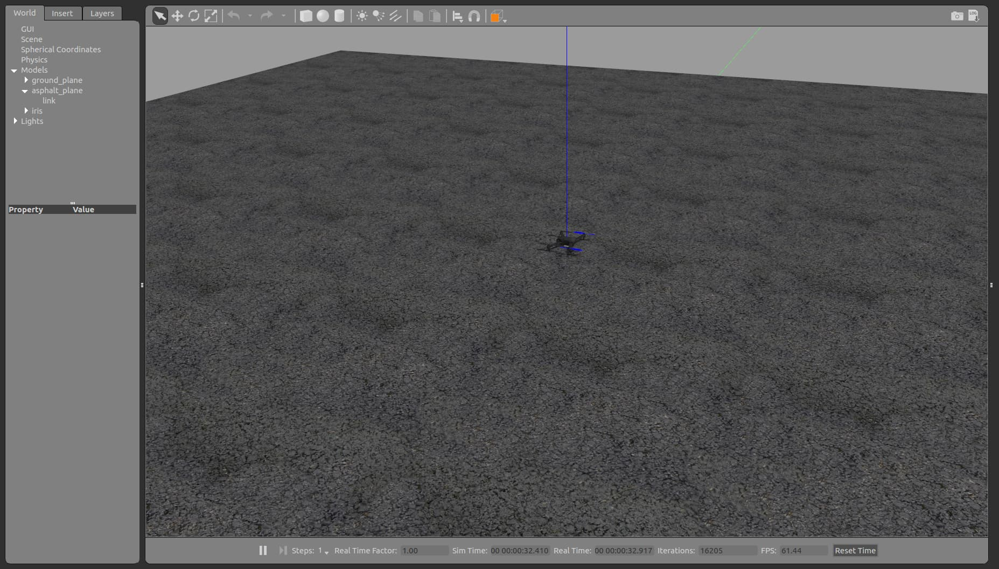

# Task 0: Installation and Setup


### General Dependencies:
To use all provided utilities, there are some packages you need to install first. Copy and paste the following commands into your terminal:

```bash
sudo apt install -y \
	ninja-build \
	exiftool \
	python3-empy \
	python3-toml \
	python3-numpy \
	python3-yaml \
	python3-dev \
	python3-pip \
	ninja-build \
	protobuf-compiler \
	libeigen3-dev \
	genromfs \
    libignition-rendering3 \
    libgstreamer-plugins-base1.0-dev \
    gstreamer1.0-plugins-bad \
    gstreamer1.0-plugins-base \
    gstreamer1.0-plugins-good \
    gstreamer1.0-plugins-ugly
```

```bash
pip3 install \
	pandas \
	jinja2 \
	pyserial \
	cerberus \
	pyulog \
	numpy \
	toml \
	pyquaternion \
    kconfiglib \
    --user packaging \
    --user jsonschema
```
### ROS-Neotic Installation:
#### Step 1. Configure your Ubuntu repositories:
Configure your Ubuntu repositories to allow “restricted,” “universe,” and “multiverse.”
You can [Follow the Ubuntu guide](https://help.ubuntu.com/community/Repositories/Ubuntu) for instructions on doing this.
#### Step 2. Setup your sources.list:
Setup your computer to accept software from [packages.ros.org](http://packages.ros.org/) .
```bash
sudo sh -c 'echo "deb http://packages.ros.org/ros/ubuntu $(lsb_release -sc) main" > /etc/apt/sources.list.d/ros-latest.list'
```
#### Step 3. Set up your keys:
```bash
sudo apt install curl # if you haven't already installed curl
curl -s https://raw.githubusercontent.com/ros/rosdistro/master/ros.asc | sudo apt-key add -
```
#### Step 4. Installation:
```bash
sudo apt update
sudo apt install ros-noetic-desktop-full
```
#### Step 5. Environment Setup:
```bash
source /opt/ros/noetic/setup.bash
```
It can be convenient to automatically source this script every time a new shell is launched. These commands will do that for you.
```bash
echo "source /opt/ros/noetic/setup.bash" >> ~/.bashrc
source ~/.bashrc
```
#### Step 6. Dependencies for building packages:
```bash
sudo apt install python3-rosdep python3-rosinstall python3-rosinstall-generator python3-wstool build-essential
sudo apt install python3-rosdep
sudo rosdep init
rosdep update
```

### MAVROS Installation:
MAVROS is a communication node based on MAVLink for ROS that is specially designed for communication between the drone and the companion computer. To install it, follow the following instructions:

```bash 
sudo apt install python3-catkin-tools python3-rosinstall-generator python3-osrf-pycommon -y 
```

**Step 1.** Create the workspace:
```bash
mkdir -p ~/catkin_ws/src
cd ~/catkin_ws
catkin init
wstool init src
```

**Step 2.** Install MAVLink: we use the Kinetic reference for all ROS distros as it’s not distro-specific and up to date
```bash
rosinstall_generator --rosdistro kinetic mavlink | tee /tmp/mavros.rosinstall
```

**Step 3.** Install MAVROS: get source (upstream - released)
```bash
rosinstall_generator --upstream mavros | tee -a /tmp/mavros.rosinstall
```
Alternatively, you can get the latest development version:
```bash
rosinstall_generator --upstream-development mavros | tee -a /tmp/mavros.rosinstall
```

**Step 4.** Create workspace & deps
```bash
wstool merge -t src /tmp/mavros.rosinstall
wstool update -t src -j4
rosdep install --from-paths src --ignore-src -y
```
**Step 5.** Install GeographicLib datasets:
```bash
sudo ./src/mavros/mavros/scripts/install_geographiclib_datasets.sh
```

**Step 6.** Build source
```bash
catkin build
```

**Step 7.** Make sure that you use setup.bash
```bash
source devel/setup.bash
```

### PX4 Firmware Installation:

Clone the PX4 Repository:
```bash
cd ~/catkin_ws/src
git clone https://github.com/PX4/PX4-Autopilot.git --recursive
cd PX4-Autopilot/
make px4_sitl_default gazebo
```
>Current versions of PX4 require an additional command to function properly. After cloning the PX4 repo and before building the workspace, cd into it
>```bash
>cd ~/catkin_ws/src/PX4-Autopilot
>```
>and then run
>```bash
>DONT_RUN=1 make px4_sitl_default gazebo
>```
>This command enables PX4 to configure itself for working with Gazebo.

Now you should see a window pop out and a drone in the middle of the environment. After verifying, press Control-C in the command line to quit Gazebo and close the window.

### PX4 Enviroment:


Build you workspace:
```bash
cd ~/catkin_ws
catkin build
```
Some extra tools to install:

```bash
pip3 install px4tools pymavlink
```

Modifying your ‘bashrc’ so that your environment remains the same every time you open a new terminal:
```bash
source ~/catkin_ws/devel/setup.bash
source ~/catkin_ws/src/PX4-Autopilot/Tools/setup_gazebo.bash ~/catkin_ws/src/PX4-Autopilot/ ~/catkin_ws/src/PX4-Autopilot/build/px4_sitl_default
export ROS_PACKAGE_PATH=$ROS_PACKAGE_PATH:~/catkin_ws/src/PX4-Autopilot
export ROS_PACKAGE_PATH=$ROS_PACKAGE_PATH:~/catkin_ws/src/PX4-Autopilot/Tools/sitl_gazebo
```

### Quick Navigation
- [Up] [Main Repository](../README.md)
- [Down] [Task 1 - Getting Started with ArUco and ROS](../task_1/README.md)
