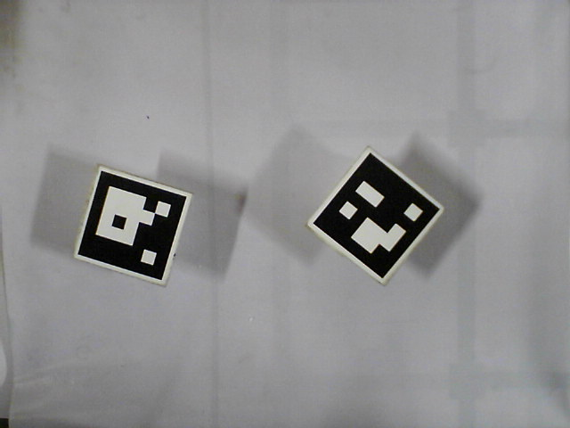
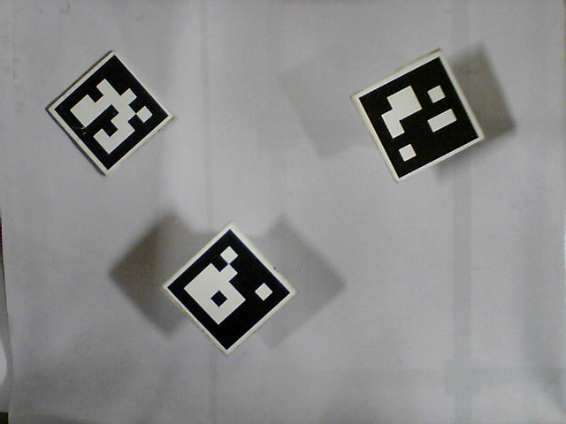
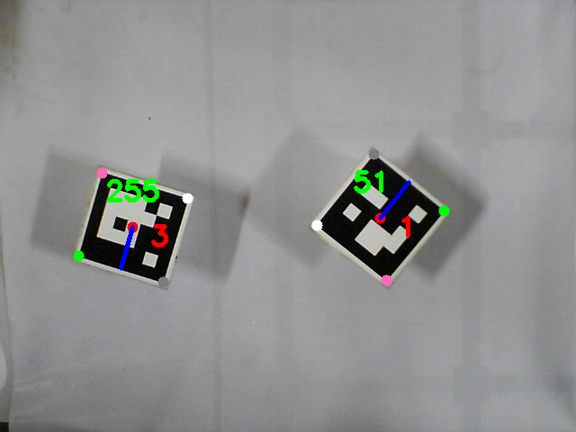
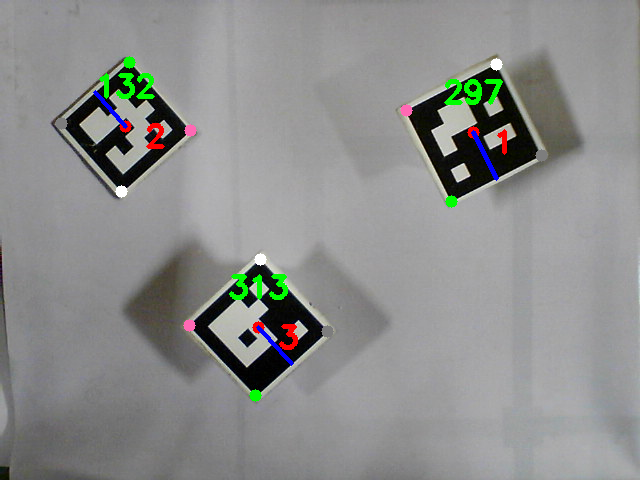

# Task 1: Getting Started with ArUco and ROS

## Task 1.1

## Overview
- Basic Image Processing techniques using OpenCV & Python
- Generating and detecting an ArUco marker
- Finding position and orientation of an ArUco marker.

## Problem Statement

Write a Python script for detecting ArUco markers. The resulting image must have ArUco markers marked as shown in the end result. Hence the resulting image will have ArUco markers with:

- Gray dot indicating top-left
- Green dot indicating top-right
- Pink dot indicating bottom-right
- White dot indicating bottom-left
- Red dot indicating center of the ArUco
- Blue line joining center of ArUco marker and the mid-point between top-left and top-right
- ArUco id number in RED colour
- Orientation of the ArUco in degrees in GREEN colour

## Test Images

### Image 1


### Image 2



## Resources

Install OpenCV library for Python:
```bash
pip3 install opencv-contrib-python
```
Note: If you already have opencv-python, remove it and install opencv-contrib-python as it can conflict with aruco library.

### 1. OpenCV Python
OpenCV resources are given below:
- [Introduction to OpenCV](https://docs.opencv.org/4.5.3/da/df6/tutorial_py_table_of_contents_setup.html)
- [GUI Features in OpenCV](https://docs.opencv.org/4.5.3/dc/d4d/tutorial_py_table_of_contents_gui.html)
- [Core Operations - Basic and Arithmetic Operations on Images](https://docs.opencv.org/4.5.3/d7/d16/tutorial_py_table_of_contents_core.html)
- [Image Processing in OpenCV - Changing Color spaces, Image Thresholding, Contours in OpenCV](https://docs.opencv.org/4.5.3/d2/d96/tutorial_py_table_of_contents_imgproc.html)

### 2. ArUco Library
### 2.1 Introduction
ArUco is an easy to use Python library for detection of ArUco markers. To know about the library functions of AruCo, open the terminal and type Python . Then type the following commands and press Enter.
```python
import cv2
help(cv2.aruco)
```
Then you can see all the available functions in ArUco library. These contents are self-explanatory of library functions in aruco module.

### 2.2 Generating an ArUco Marker
**Step 1.** Create a Python script and add the required libraries.
```python
import numpy as np
import math
import cv2
import cv2.aruco
```
**Step 2.** Select a Dictionary provided by the aruco module.
```python
aruco_dict = aruco.Dictionary_get(aruco.DICT_5x5_250)
```

**Step 3.** Generating markers of any id from the defined dictionary with a required output image size  and marker size.
```python
img = aruco.drawMarker(aruco_dist,11, 400)
```

### 2.3 Detection of ArUco marker
**Step 1.** Create a Python script and add the required libraries
```python
import numpy as np
import math
import cv2
import cv2.aruco
```
**Step 2.** Load the corresponding image matrix to a variable, for example img, using cv2 operation.
**Step 3.** Convert the image matrix from RGB to grayscale using cv2 operation
```python
gray = cv2.cvtColor(img, cv2.COLOR_BGR2GRAY)
```
**Step 4.** Select a Dictionary provided by the aruco module.
```python
aruco_dict = aruco.Dictionary_get(aruco.DICT_5x5_250)
```
**Step 5.** Create an object variable, for example parameters, which includes all the options that can be customized during the marker detection process.
```python
parameters = aruco.DetectorParameters_create()
```
**Step 6.** Detect the markers of the corresponding dictionary from the grayscale image considering marker detection parameters.
```python
corners, ids, _ = aruco.detectMarkers(gray, aruco_dict, parameters = parameters)
```
## Procedure
Run the following command
```bash
cd ~/catkin_ws/src/strawberry_stacker/task_1/scripts
python3 aruco_detection.py
```
## Results

### Image 1:


### Image 2:


### Video:

https://user-images.githubusercontent.com/47444101/178815672-65883e76-a28a-498e-9271-a96d955a18d0.mp4

## Task 1.2

## Overview
- Getting started with ROS
- Subscribing video frames from a ROS topic
- Publishing messages over a ROS topic

## Resources
- Highly recommended to follow [ROS tutorials](http://wiki.ros.org/ROS/Tutorials) (following till 1.1.13 will be enough for this task) before proceeding with the actual task as the learning curve might be steep in the start.
- This task will require the knowledge of _rosnodes_, _rostopic_, publisher & subscriber model

## Problem Statement

- Create a _rosnode_ named _marker_detection_ in a python script, which will detect a moving ArUco marker from the video feed of camera and will publish the id, position and orientation of the marker on a _rostopic /marker_info_

- You need to subscribe to a rostopic named _/camera/camera/image_raw_ to read camera the video frames from camera

- Apply the ArUco detection on these frames and publish the results on the _rostopic /marker_info_ in the message type _task_1/Marker_

## Procedure

- Launch the Gazebo world by typing the following command
```bash
roslaunch task_1 task1_2.launch
```
Once the simulation window launches, you should see a static camera in air poiting downwards and there will be an ArUco marker moving in a pattern.

- Run your python script in a separate terminal to start detecting and publishing the ArUco details
```bash
rosrun task_1 marker_detection.py
``` 
> Note: To avoid manually typing the rosrun command for every iteration, you can start the rosnode in the launch file itself, to do that add the following lines in the task_1.2.launch file in the launch folder. Make sure you add the line before the ```</launch>``` line.
```xml
<node name="marker_detection" type="marker_detection.py" pkg="task_1" />
```
To record ROS messages enable recording via rosbag utility:
```bash
roslaunch task_1 task1_2.launch record:="true" rec_name:="aruco_detection.bag"
```
