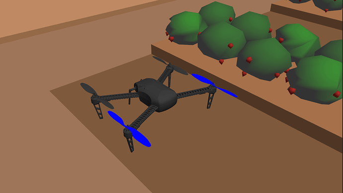
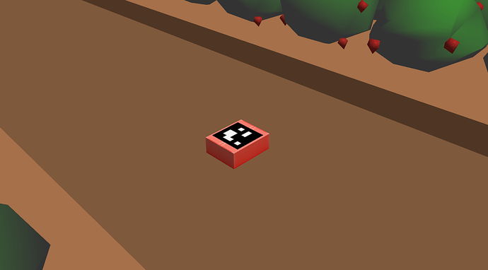
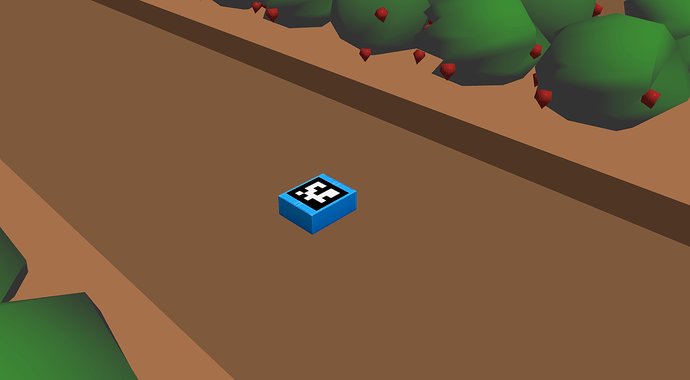
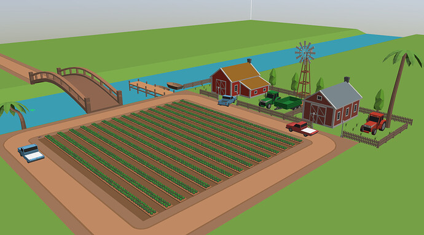
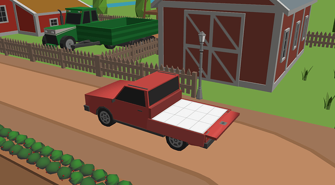
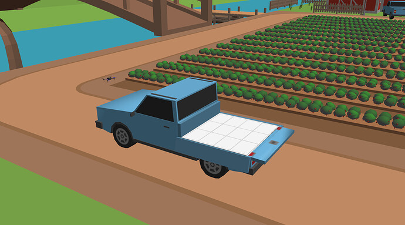

# Task 6: Final Theme Implementation

## 0. Installation
Please check if the spawning_final.py file is executable. If not, please make it one by running the following command in the directory where the file is present.
```bash
roscd task_6/scripts
chmod +x spawning_final.py 
```

## 1. Introduction

### 1.1 Background
Unmanned Aerial Vehicles(UAVs) and the Unmanned Aerial Systems(UAS) they are a part of are a large and active area of engineering, research, development and deployment.

UAVs also colloquially called drones are self-powered flying vehicles without a human pilot onboard, they may have varying degrees of autonomy from fully autonomous to fully controlled by a offboard human pilot.

A UAS is the larger system that the UAV is part of, and it includes elements such as ground stations and the data links between UAVs and ground stations; aspects which are equally critical for successful missions.

We shall be developing and deploying our application in a simulator, this is to make the most efficient use of our development time and effort. Physically flying a UAV requires a lot of time, effort in terms of setup, maintenance, monitoring and daily upkeep. The procurement and operational costs are also not insignificant.

Thankfully, the excellent open source software pipeline typically deployed on UAVs allows us to replace a physical UAV with one in the simulator, with the rest of the system remaining the same. This process is called Software-in-the-Loop (SITL) simulation and is a quick, cheap, reliable and hassle-free way to get started with developing applications. A vast majority of application development work should and does happen with such SITL simulations.

### 1.2 Problem Statement
Our problem statement consists of a team of multiple autonomous drones, tasked with identifying and picking boxes from in-between the strawberry rows and then stacking them in a palletized form onto two parked flatbed trucks.

### 1.3 Tools Used
For solving our problem statement we shall use PX4 Autopilot ecosystem for controlling the UAV, Gazebo simulator, a robotics simulator, where the simulated farm and UAV’s will reside, and ROS for integrating various aspects of autonomy required in the solution.

## 2. Description
This project is an abstraction of a strawberry farm. It is the harvesting scenario in the strawberry farm where the harvesters are plucking the strawberry selectively which are ready for harvesting and packing them into small boxes. The harvesters usually separate the premium quality strawberries and pack them in a RED coloured box whereas the standard quality ones are packed in a BLUE coloured box. The boxes then have to be placed on respective trucks (red boxes on red truck and blue boxes on blue truck) to ship them further. This entire task from plucking to shipping has to be done as quickly as possible.

### 2.1 Terms

#### 2.1.1 eDrone
- The eDrone is the Unmanned Aerial Vehicle (UAV) which is the delivery agent in the theme
- The eDrone is a quadcopter model designed in the Gazebo simulation environment



#### 2.1.2 Strawberry Box
- There are two kinds of strawberry boxes being packed, the premium quality ones packed in a RED box and standard quality ones in BLUE box
- The boxes have to be transported from one place to another by *eDrones*
- Each box is a cuboid in the Gazebo simulation environment of the dimensions: L = 0.3m W = 0.24m H = 0.104m
- The boxes spawn in the gazebo environment as and when the harvesters complete packing them. Harvesters start harvesting parallelly in rows and proceed further in the same direction. As a result, the boxes can spawn simultaneously in the parallel rows. However, in any given row, boxes will spawn in a strictly increasing order by distance over the length of the row. For eg. In a row, the last box spawned is at a distance of 5m from the start of the row, then the next box will strictly spawn at a distance greater than 5m. This simulates the harvester proceeding further in a row
- Each strawberry box has an ArUco marker pasted on it by the harvesters for the *eDrones* to identify them and locate them precisely from a height. The ArUco id’s of red and blue boxes will be 1 and 2 respectively





### 2.2 Inputs
- As soon as a box is spawned in a row, a message will be published on a *rostopic* named ```/spawn_info``` which will just contain the row number in which the box has been spawned
- The exact location and the type of the box spawned will NOT be shared but can be approximated by simple logic. For eg. the co-ordinate of a particular row is known, one can keep a track of number of boxes spawned in each row, so as soon as a new box is spawned, the approximate distance of the box can be estimated and then the *eDrone* can scan the approximate area and get the precise location of the box by searching for an ArUco marker and pick it up. The color of the box can be identified by the ArUco ID.

## 3. Arena
### 3.1 Strawberry Farm
- The entire arena will be a strawberry farm constructed in a Gazebo simulation environment
- The farm contains 15 rows of strawberry plants spaced at a distance of 4m. Each row of plant is followed by empty space where boxes will be spawned
- The rows are numbered from 1-15 from left to right, row 1 being the 1st row. The exact coordinate of the 1st row will be provided before the run
- The farm has two flatbed trucks which is the delivery location for all the strawberry boxes



### 3.2 Delivery Truck
- A delivery truck is the area where the eDrone is supposed to land and drop the strawberry box.
- There are 2 types of delivery trucks, one is RED coloured and another is a BLUE coloured. Each one has to carry appropriate coloured boxes.
- The trucks have a grid drawn on them and the respective strawberry boxes are to be placed in the rectangular cells inside the grid. However, the eDrones can stack multiple boxes on a single cell.
- The exact coordinate of the 1st cell (which is the top left cell) as well as the length and width of each cell will be provided before the run.





## 4. Simulation Flow
- There is a given launch file that will load the gazebo world containing 2 drones. We need to prepare another launch file that contains all the scripts and *rosnodes* to perform the task and launch this file before anything else. Then participants can launch the file provided which will start the gazebo simulator. The start time will be considered when this launch file is run.
- After launching the scripts/*rosnodes*, the drones should takeoff and start their delivery jobs. The spawning of the strawberry boxes will be in a pseudo random order and their location will be shared on the *rostopic* as soon as it spawns
- The *eDrones* are allowed to pick any strawberry boxes in any order, there is no specific requirement to follow any kind of first come first serve pattern
- The *eDrones* have to pick and place as many number of boxes in 5 minutes run time

### Quick Navigation
- [Up] [Task 5 - Theme Implementation](../task_5/README.md)
- [Down] [Main Repository](../README.md)
